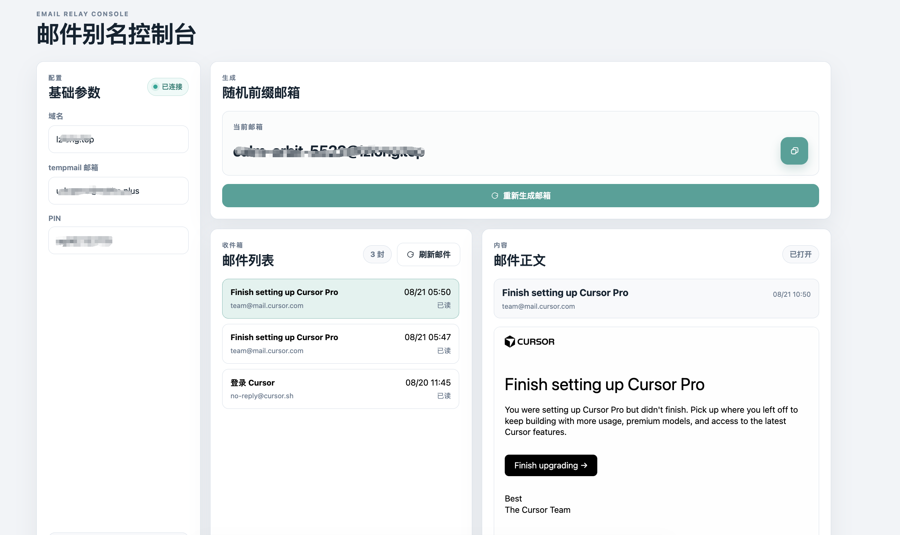

# 邮件别名控制台

一个基于 Next.js 的个人邮箱别名与临时收件箱控制台。

项目利用 Cloudflare Email Routing 将个人域名下的随机邮箱前缀转发到 TempMail.Plus 收件箱，然后通过 TempMail.Plus 的邮箱接口读取邮件列表和邮件正文。适合用于测试环境、一次性注册流程和验证码邮件查看。

> 请仅在你拥有或获授权的域名、邮箱和第三方服务上使用本项目。不要用于绕过平台的安全限制、批量注册或违反目标服务条款的行为。

## 界面预览



## 功能

- 配置个人域名、TempMail.Plus 邮箱和邮箱 PIN
- 生成随机邮箱前缀
- 一键复制当前生成的邮箱地址
- 重新生成邮箱前缀
- 连接 TempMail.Plus 收件箱
- 查看 Cloudflare 转发过来的邮件列表
- 查看邮件主题、发件人、时间和已读状态
- 在安全沙箱 iframe 中预览 HTML 邮件
- 处理邮件中的 `cid:` 内嵌图片
- 支持 HTML 邮件和纯文本邮件
- 使用浏览器 `localStorage` 保存当前配置和连接状态
- 适配桌面端和移动端
- 支持 Vercel 部署

## 工作流程

```text
个人域名
    |
    | Cloudflare Email Routing
    v
随机前缀@你的域名
    |
    v
TempMail.Plus 收件箱
    |
    | Next.js Server Route 代理请求
    v
邮件列表与正文预览
```

### 1. 配置 Cloudflare Email Routing

在 Cloudflare 中为你的域名配置邮件路由，将个人域名下的邮件转发到 TempMail.Plus 邮箱，例如：

```text
*@example.com -> your-mailbox@mailto.plus
```

本项目不会自动创建 Cloudflare 路由，Cloudflare 路由需要提前配置完成。

### 2. 配置 TempMail.Plus

准备一个可用的 TempMail.Plus 邮箱，例如：

```text
your-mailbox@mailto.plus
```

如果该邮箱设置了 PIN，请在页面中填写对应 PIN。这里的 PIN 是邮箱访问 PIN，不是 API Key。

### 3. 在控制台中使用

填写以下信息：

- `域名`：个人域名，例如 `example.com`
- `tempmail 邮箱`：实际接收转发邮件的 TempMail.Plus 邮箱
- `PIN`：TempMail.Plus 邮箱 PIN

点击“连接收件箱”后，系统会验证邮箱并加载邮件列表。之后可以生成随机前缀，例如：

```text
calm-orbit-5522@example.com
```

## 技术栈

- Next.js 15
- React 18
- App Router
- Turbopack 开发模式
- Vercel Serverless Functions
- TempMail.Plus API
- Cloudflare Email Routing

## 本地运行

### 环境要求

- Node.js 18.18 或更高版本
- npm 9 或更高版本
- 一个已经配置 Cloudflare Email Routing 的域名
- 一个可用的 TempMail.Plus 邮箱

### 安装依赖

```bash
npm install
```

### 启动开发服务

```bash
npm run dev
```

默认地址：

```text
http://localhost:3000
```

如果 3000 端口已被占用，可以指定其他端口：

```bash
npm run dev -- -p 3001
```

### 生产构建

```bash
npm run build
npm run start
```

## Vercel 部署

1. 将项目推送到 GitHub。
2. 登录 Vercel，点击 `Add New Project`。
3. 选择 GitHub 仓库。
4. Framework Preset 选择 `Next.js`。
5. 保持默认构建配置。
6. 点击部署。

本项目没有必须配置的服务端环境变量。用户输入的邮箱和 PIN 只在当前浏览器中保存，并通过 Next.js Server Route 发送到 TempMail.Plus。

## 项目结构

```text
.
├── app/
│   ├── api/
│   │   ├── inbox/route.js       # 验证并连接临时邮箱
│   │   ├── message/route.js     # 获取单封邮件正文
│   │   └── messages/route.js    # 获取邮件列表
│   ├── globals.css               # 全局样式与响应式布局
│   ├── layout.js                 # 根布局和页面元信息
│   └── page.js                   # 控制台主页面
├── lib/
│   └── tempmail.js               # TempMail.Plus API 适配层
├── docs/
│   └── preview.png               # 项目界面预览图
├── .gitignore
├── package.json
└── package-lock.json
```

## API 说明

服务端通过以下接口代理 TempMail.Plus 请求：

```text
GET https://tempmail.plus/api/mails
GET https://tempmail.plus/api/mails/:mail_id
GET https://tempmail.plus/api/mails/:mail_id/attachments/0
```

请求参数主要包括：

- `email`：TempMail.Plus 邮箱地址
- `epin`：邮箱 PIN
- `limit`：邮件列表数量限制
- `content_id`：内嵌邮件图片的 Content-ID

浏览器不会直接调用 TempMail.Plus，也不会把 PIN 拼接到邮件正文的图片 URL 中。邮件内嵌图片会由服务端读取后转换为 `data:` URL，再交给沙箱 iframe 渲染。

## 安全与隐私

- 不要把真实 PIN 写入源码、README 或 `.env` 以外的文件。
- 不要提交 `node_modules`、`.next`、`.env` 或本地日志文件。
- 当前配置保存在浏览器 `localStorage` 中，清理浏览器站点数据即可删除。
- TempMail.Plus 邮件的保存时间和服务可用性由第三方服务决定。
- HTML 邮件在 `sandbox` iframe 中显示，仍应谨慎打开邮件中的外部链接。
- 生产环境建议为 Vercel 项目增加访问控制，避免任何人使用你的部署地址读取邮箱。

## 限制

- 本项目目前负责邮箱生成、收件箱读取和邮件正文预览。
- 普通 Vercel 网页不能直接控制用户正在使用的第三方网站，也不会自动填写其他网站的注册表单。
- 如果需要浏览器自动填写，需要额外开发浏览器扩展或受控的浏览器自动化程序。
- 外链图片可能受到邮件服务商、防盗链策略或浏览器隐私策略影响。

## 开发命令

```bash
npm run dev       # 使用 Turbopack 启动开发服务
npm run build     # 创建生产构建
npm run start     # 启动生产服务
```

## License

当前仓库未指定开源许可证。若要公开分发，请根据你的使用场景补充合适的 License 文件。
